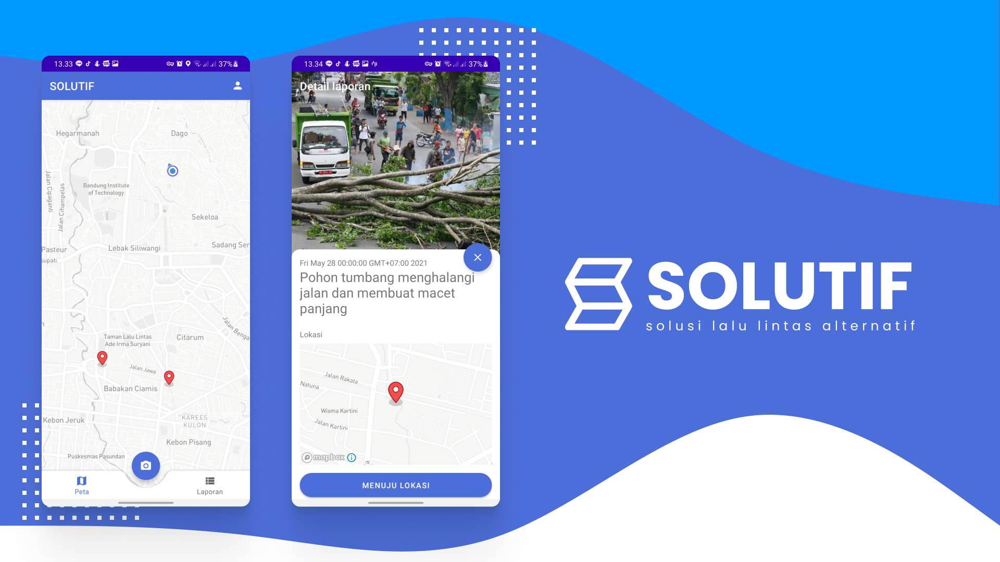
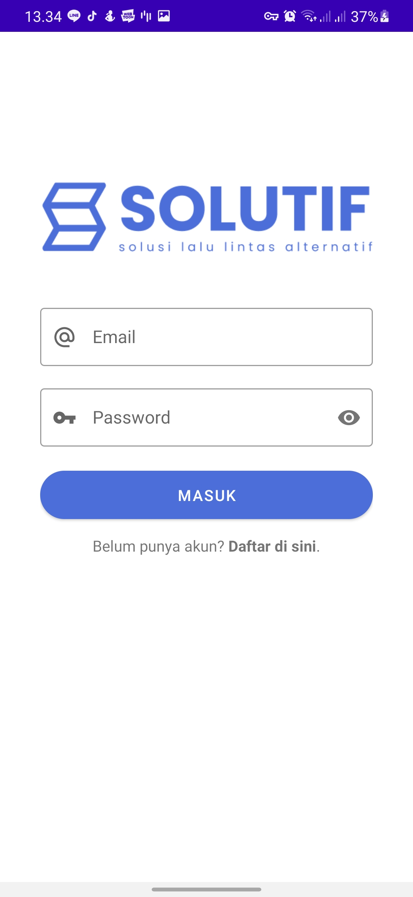
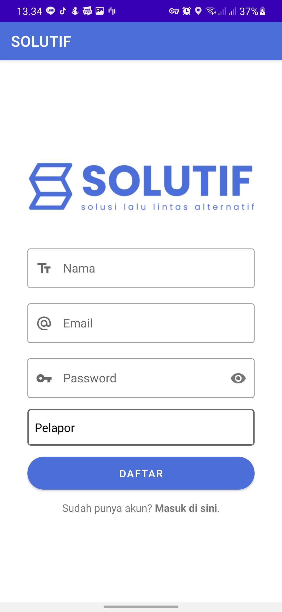
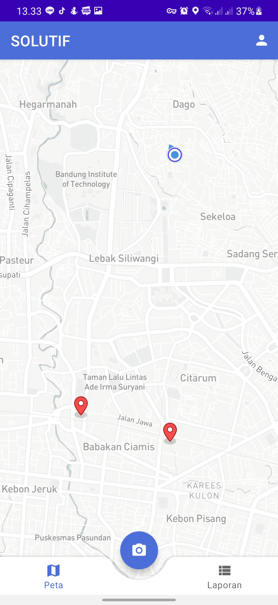
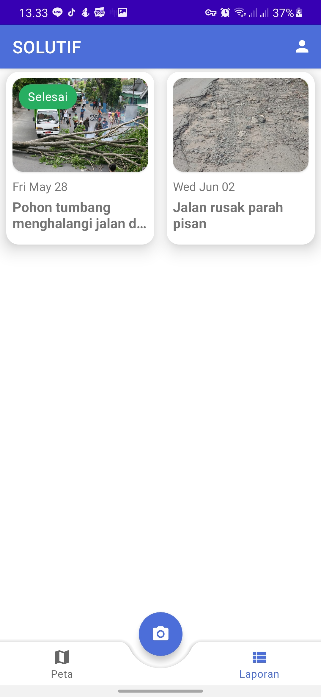
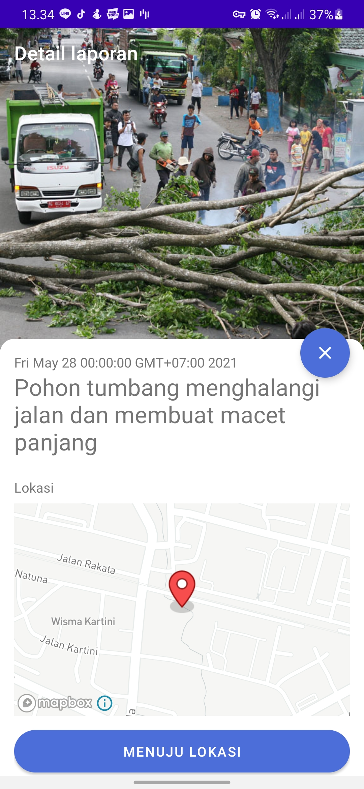
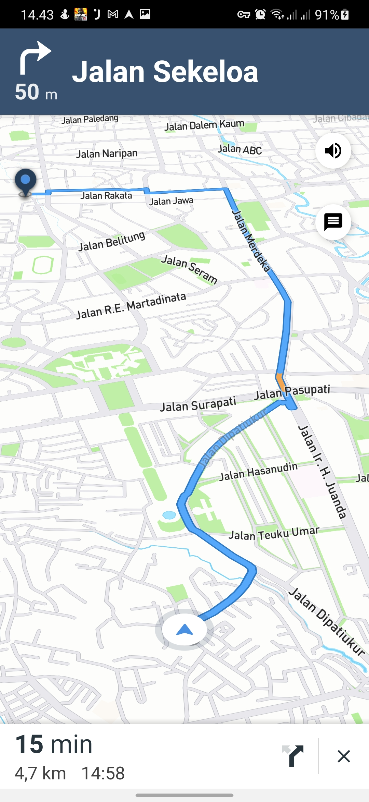
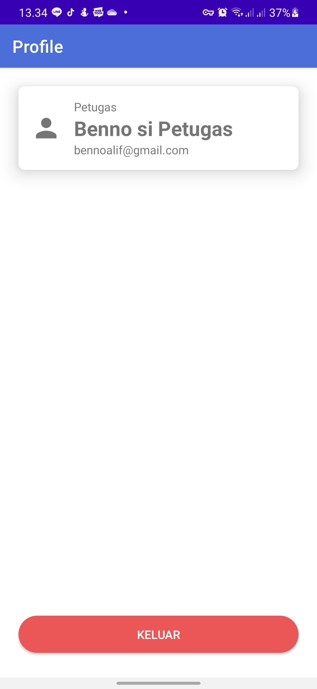

# SOLUTIF : Solusi Lalu Lintas Alternatif

An application for monitoring street condition or road traffic condition such as road potholes, fallen trees, etc.

## Table of Contents

- [Introduction](#introduction)

- [Features & Screenshots](#features--screenshots)

- [Tech Stack](#tech-stack)

- [Dependencies](#dependencies)

- [Download the App](#download-the-app)

  

## Introduction

SOLUTIF is an application for monitoring street condition or road traffic condition such as road potholes, fallen trees, etc. The application will be used by the transportation service officer that works in the road. They submit the condition report, and the officer who responsible to solve the problem will go to the place that been reported before and solve the problem. After the problem solved, the reported condition will be checked as solved on the reported log. This system expected to reduce traffic congestion that can happen because of the road traffic problem.

Using the MVVM, Repository pattern, Dependency Injection, and Modularization architecture to make code easier to read and maintain, and use several Firebase services such as Authentication to simplify user management, Cloud Firestore to get the latest data quickly, and Storage to manage the storage of each photo report.

For third-party libraries this project uses the Mapbox API, besides being easy to use, the API can also be used for free (Pay-as-you-go). The API is used to display the map to make it more interactive.

## Features & Screenshots

| Name          | Screenshot                                      | Description                                                  |
| ------------- | ----------------------------------------------- | ------------------------------------------------------------ |
| Splash Screen |  | Just an ordinary Splash Screen with a logo in the center of the screen. |
| Login         |         | Login with your registered email and password. This feature is used for authentication and distinguishing the roles of reporter and operator. |
| Register      |      | To register a user in order to login. User can choose to be "Operator" or "Reporter |
| Home/Maps     |          | The page that will appear after the user logs in. The map shows where the report was reported. If one of the reports is pressed, it will immediately be directed to the detail feature. |
| Reports       |       | Displays all reports in the list, if one of the reports is pressed, it will immediately be directed to the detail page. Report data will automatically change when new reports are added or deleted. |
| Details       |       | The page that displays the report details, there are photos, descriptions, completion status, and the location of the report is made in the form of a map. If the logged in user is an operator, then that user can go to the location using navigation and can change the completed status. |
| Navigation    |    | A navigation feature that will direct the user to where the report is reported. This feature can only be used by operator. |
| Profile       |       | To display the data of users who are currently logged in and there is a button to logout. |

## Tech Stack

- MVVM (Model-View-ViewModel) Architecture Pattern
- Modularization (core module)
- Dependency Injection with Koin
- ViewBinding
- Obfuscation with Proguard

## Dependencies

- [Mapbox](https://docs.mapbox.com/help/tutorials/first-steps-android-sdk/)
- [Glide](https://github.com/bumptech/glide)
- [AndroidX](https://mvnrepository.com/artifact/androidx)
- [Cardview](https://developer.android.com/jetpack/androidx/releases/cardview)
- [Firebase](https://firebase.google.com/)
  - [Authentication](https://firebase.google.com/docs/auth/android/start)
  - [Cloud Firestore](https://firebase.google.com/docs/firestore/quickstart)
    - [Firestore UI](https://firebaseopensource.com/projects/firebase/firebaseui-android/firestore/readme/)
  - [Cloud Storage](https://firebase.google.com/docs/storage/android/start)
- [Lifecycle & LiveData](https://developer.android.com/jetpack/androidx/releases/lifecycle)
- [Koin](https://github.com/InsertKoinIO/koin)
- [Leak Canary](https://github.com/square/leakcanary)

## Download the App

[Download](https://drive.google.com/file/d/1Frk1aVe8V5HpKMhX6Ib6zwieNSheAZpF/view?usp=sharing)